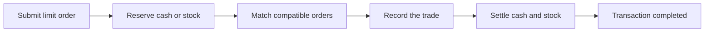
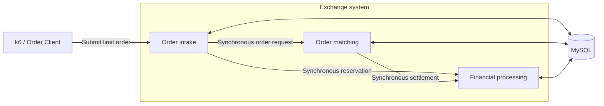
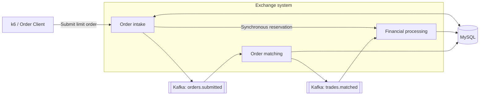
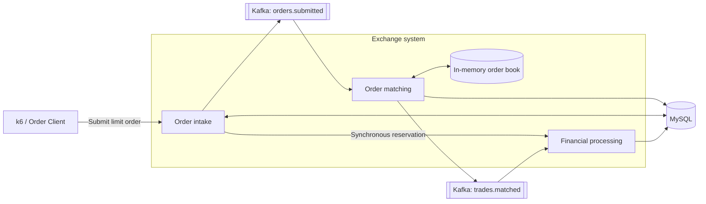
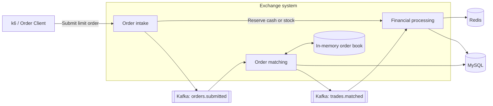
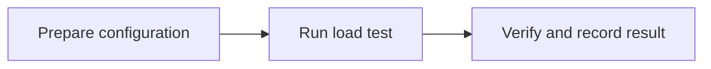
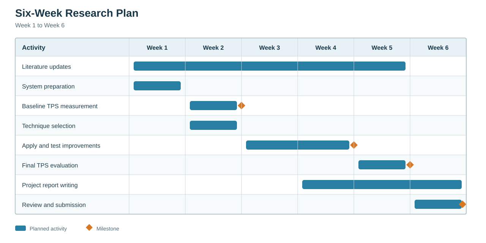

# Assignment 2 Project Proposal

> Project direction: [Assignment 2 Project Starting Point](02-project-core-idea.md)

> Table of Contents
>
> - [1. Introduction](#1-introduction)
> - [2. Research Background](#2-research-background)
>   - [2.1. What Existing Research Shows](#21-what-existing-research-shows)
>   - [2.2. What Is Missing](#22-what-is-missing)
>   - [2.3. How This Project Responds](#23-how-this-project-responds)
> - [3. Problem Statement](#3-problem-statement)
> - [4. Research Questions](#4-research-questions)
> - [5. Aim and Objectives](#5-aim-and-objectives)
>   - [5.1. Research Aim](#51-research-aim)
>   - [5.2. Research Objectives](#52-research-objectives)
> - [6. Scope of the Research](#6-scope-of-the-research)
> - [7. Significance of the Research](#7-significance-of-the-research)
> - [8. Research Methodology](#8-research-methodology)
>   - [8.1. Research Design](#81-research-design)
>   - [8.2. Experimental System and Setup](#82-experimental-system-and-setup)
>   - [8.3. Experimental Configurations](#83-experimental-configurations)
>   - [8.4. Experimental Procedure](#84-experimental-procedure)
>   - [8.5. Measurement and Data Analysis](#85-measurement-and-data-analysis)
>     - [8.5.1. C0 Synchronous Database Baseline](#851-c0-synchronous-database-baseline)
>     - [8.5.2. C1 Kafka-Based Sequential Processing](#852-c1-kafka-based-sequential-processing)
>     - [8.5.3. C2 In-Memory Order Matching](#853-c2-in-memory-order-matching)
>     - [8.5.4. C3 Redis-Based Reservation](#854-c3-redis-based-reservation)
>     - [8.5.5. Overall Comparison](#855-overall-comparison)
>   - [8.6. Reliability, Validity, Ethics, and Limitations](#86-reliability-validity-ethics-and-limitations)
> - [9. Research Plan](#9-research-plan)
> - [10. Summary](#10-summary)
> - [11. References](#11-references)

## 1. Introduction

Modern software systems often need to handle many requests at the same time. When demand increases, the system may become slow, return errors, or stop processing work reliably. Achieving high concurrency therefore means more than accepting a large number of requests. The system must complete a high volume of transactions consistently and continue doing so under sustained demand.

Many areas of a system can be improved to increase TPS, including the application, database, cache, messaging service, network, and use of computing resources. Each area offers different performance techniques, but their value depends on the system and workload. These techniques are tools for increasing TPS; they are not the final goal. Although this project will evaluate one Java transaction-processing system, the general improvement approach may also be useful for systems developed with other languages and technologies. The experimental findings will remain limited to the selected system.

The selected experimental system is Exchange Lab, a backend system modelled on a stock exchange. It supports limit buy and sell orders, in which a trader specifies the stock symbol, quantity, and maximum buying price or minimum selling price. Processing an order may require the system to reserve the trader's cash or stock, match compatible orders by price and submission time, record the resulting trade, and settle the affected balances. The system is used as a transaction-processing testbed; the research does not attempt to reproduce every function of a commercial stock exchange.

This research will measure the system's baseline TPS, add Kafka, in-memory matching, and Redis reservation one at a time, and test the system after each change. The process will show how far sustainable completed TPS can be increased within the defined environment. Response time, errors, unfinished work, and correctness will be checked to ensure that a higher TPS remains stable and meaningful. The following sections explain the research background, problem, questions, aim, objectives, scope, and significance before presenting the methodology and research plan.

## 2. Research Background

### 2.1. What Existing Research Shows

Previous research shows that high concurrency depends on the complete system, not one programming feature or service. Studies have tested application-level concurrency, caching, asynchronous processing, traffic management, scaling, and overload control. Their results show that these techniques can improve performance, but their value changes with the workload, framework, system structure, and available dependency capacity (Henning & Hasselbring, 2024; Navarro et al., 2023; Xing et al., 2025; Zhang et al., 2024). The practical value of a technique depends on whether it produces a measurable increase in sustainable completed TPS in the system being tested.

These findings also show why a technique cannot be judged by its description alone. Increasing request concurrency helps only while the rest of the system can process the additional work. Caching or asynchronous processing may reduce immediate work, but completed TPS still depends on the full transaction path. The system must therefore be measured as a whole.

### 2.2. What Is Missing

Existing studies use different applications, environments, workloads, test durations, and performance measurements. Many evaluate one component in isolation and report a local improvement without showing the effect on the complete request path. An improvement may therefore move the bottleneck instead of increasing completed end-to-end throughput (Meijer et al., 2024). The available evidence does not clearly show how far sustainable completed TPS can be increased when relevant improvements are selected from system measurements and applied iteratively across the same Java transaction-processing system under consistent conditions.

Developers therefore have many possible techniques but limited guidance on which ones will produce the largest gain in a particular system. A controlled end-to-end test is needed to connect each applied change to a measurable difference in TPS.

### 2.3. How This Project Responds

This project will use one Java transaction-processing system, a consistent workload, and the same measurements across all tests. It will establish the baseline, add Kafka, in-memory matching, and Redis reservation separately, and retest the system after each change. The purpose is to determine how each technique affects sustainable completed TPS while latency, errors, unfinished work, and correctness remain acceptable.

A change will be considered useful only when it increases sustainable TPS for the complete system. This keeps the project focused on the final result rather than the number or complexity of the techniques used.

## 3. Problem Statement

> Many areas of a high-concurrency Java transaction-processing system can be improved to increase throughput. The problem is how to identify and apply the most effective improvements across the system to push sustainable completed TPS as high as possible.

The practical problem is not a shortage of performance techniques. It is determining which techniques genuinely raise the completed transaction rate of the selected system. Without a consistent baseline and repeated testing, an apparent improvement may only shift waiting work elsewhere or produce a short-lived peak that cannot be sustained.

Different parts of the system offer different opportunities for improvement. However, a technique that improves one system or workload may provide little benefit in another, and improving one area may change the behaviour of the remaining system. Each change must therefore be selected and measured according to its effect on completed end-to-end TPS (Henning & Hasselbring, 2024; Meijer et al., 2024).

The study will compare the synchronous baseline with configurations that add Kafka, in-memory matching, and Redis reservation one at a time. Its primary outcome will be the highest sustainable completed TPS achieved by each configuration. Latency, errors, unfinished work, and correctness will determine whether a reported improvement is valid.

## 4. Research Questions

The study will address the following research questions:

1. RQ1: What TPS can the current system sustain before any improvements?
2. RQ2: Which applied techniques increase sustainable TPS, and by how much?
3. RQ3: What is the highest sustainable TPS achieved after applying the relevant improvements?

## 5. Aim and Objectives

### 5.1. Research Aim

To maximise the sustainable TPS of the selected Java transaction-processing system.

### 5.2. Research Objectives

The research objectives are:

1. O1: To measure the system's current sustainable TPS.
2. O2: To identify suitable techniques for increasing TPS.
3. O3: To apply the selected techniques.
4. O4: To determine the highest sustainable TPS achieved.

## 6. Scope of the Research

This research focuses on improving the sustainable TPS of one selected Java transaction-processing system. It will first establish the system's current TPS. Relevant performance techniques will then be applied and tested in the same environment. The study will determine the highest sustainable TPS achieved within the available project time and resources.

The work is limited to components available in the selected system and techniques that can be implemented during the project. The findings will explain what worked under the chosen workload and environment. They will not be treated as a universal configuration for every Java system.

## 7. Significance of the Research

This research matters because a system that sustains a higher TPS can complete more transactions during heavy demand. Measuring the complete system will show whether an improvement produces a real end-to-end gain rather than only making one component faster (Henning & Hasselbring, 2024; Meijer et al., 2024). The final result will show how far TPS was increased and the conditions under which that increase remained sustainable.

The practical value is a clear record of the changes that worked in the selected system. Developers can adapt the same measurement-based process when improving similar systems. The research also extends the Assignment 1 literature review by testing relevant techniques in a working system and producing experimental evidence.

## 8. Research Methodology

### 8.1. Research Design

This research uses a simplified stock-exchange backend simulator as the environment for evaluating concurrent transaction processing. The simulator models one core exchange workflow: receiving limit buy and sell orders, reserving cash or stock, matching compatible orders, recording trades, and settling completed transactions. It does not reproduce an entire real exchange or use real money, investors, or live market data. Instead, the trading workflow provides a realistic transaction scenario whose inputs, processing stages, and final records can be repeatedly measured and verified. This experimental system is referred to as Exchange Lab.

The study uses a controlled quantitative design to determine how architectural changes affect sustainable completed transactions per second (TPS). Four system configurations are evaluated in sequence, beginning with a synchronous database baseline and then adding Kafka, in-memory matching, and Redis reservation. Every configuration performs the same limit-order transaction under the same machine, test data, workload pattern, and measurement conditions. Completed TPS is the main result, while latency, errors, unfinished work, and correctness determine whether that result is valid. Comparing each configuration with its immediate predecessor makes the effect of each major technique clearer than testing only the final system.

### 8.2. Experimental System and Setup

Exchange Lab is the experimental testbed. It is a Java and Spring Boot backend that supports limit buy and sell orders. A limit order specifies the trader, stock symbol, quantity, side, and price. This workflow is used because every order passes through reservation, matching, trade recording, and financial settlement, producing a complete transaction that can be measured and verified.



*Figure 1. Common limit-order transaction used in every configuration.*

The internal implementation changes between configurations, but the input, required business result, and test conditions remain consistent.

| Item | Common experimental setup |
|---|---|
| Execution environment | The same computer, operating system, Java 26 runtime, and JVM settings |
| Durable data | MySQL 8.4 |
| Supporting platforms | Kafka 4.1.0 and Redis 7.4 only when required by the configuration |
| Test data | The same trader accounts, stock positions, and initial sell orders |
| Workload | The same k6 limit-buy-order workload and controlled request-rate pattern |
| Observation | Application and system metrics, Kafka lag where applicable, and SQL correctness checks |

The exact machine specifications, JVM settings, request rates, and warm-up, measurement, and drain periods will be fixed and recorded before formal testing.

### 8.3. Experimental Configurations

The experiment compares four staged configurations of the same exchange system. The internal order-intake, matching, and financial-processing responsibilities remain present throughout the experiment. Each configuration changes only the performance technique being evaluated.

#### C0: Synchronous Database Baseline

C0 establishes the reference result. Order intake, matching, and financial processing communicate synchronously and use MySQL.



*Figure 2. C0 synchronous database baseline.*

#### C1: Kafka-Based Sequential Processing

C1 adds Kafka between order intake and matching and between matching and financial settlement. One consumer processes submitted orders sequentially.



*Figure 3. C1 configuration with Kafka-based sequential processing.*

#### C2: In-Memory Order Matching

C2 retains Kafka and adds an in-memory price-time order book. MySQL continues to store orders and trades durably.



*Figure 4. C2 configuration with in-memory order matching.*

#### C3: Redis-Based Reservation

C3 retains Kafka and in-memory matching while adding Redis for atomic cash and stock reservation. MySQL remains the durable store.



*Figure 5. C3 configuration with Redis-based reservation.*

### 8.4. Experimental Procedure

Each configuration follows the same three-phase procedure:



*Figure 6. Experimental procedure used for every configuration.*

#### Phase 1: Prepare the Configuration

- Load the required configuration from its recorded Git commit or an isolated worktree, build it, and start its required components.
- Reset MySQL, Kafka, and Redis where applicable, then load the same trader accounts, stock positions, and initial sell orders.
- Confirm that the system is healthy, complete the fixed JVM warm-up, and record the environment and test settings.

#### Phase 2: Run the Load Test

- Use k6 to submit the standard limit-buy-order workload at the planned target request rate.
- Repeat the load test at each predefined request rate using the same measurement period.
- Stop new requests, allow asynchronous work to drain for the fixed period, and collect the performance measurements.

#### Phase 3: Verify and Record the Result

- Use SQL checks to verify cash, stock, reservations, order states, and trade records. Discard the run if the data is incorrect or the system is unstable.
- Repeat each selected test three times under the same conditions.
- Store the verified setup and results for analysis.

### 8.5. Measurement and Data Analysis

The experiment uses three TPS values. Target TPS is the request rate configured in k6. Accepted TPS is the number of orders accepted by the system per second. Completed TPS is the number of settlements completed per second and is the primary result. In this controlled workload, each accepted buy order produces one trade and one settlement.

Completed TPS will be calculated from the settlement-counter increase recorded at the end of the measurement period, before the drain wait. The post-drain counter and Kafka lag are used only to record unfinished work.

A tested rate passes only when:

1. Completed TPS keeps pace with accepted TPS.
2. No unfinished work continues to accumulate, and the fixed drain period clears the remaining work.
3. No requests or k6 iterations fail, and all SQL correctness checks pass.

For asynchronous C1-C3, keeping pace means that at least 98% of accepted orders complete during the measurement period, while the drain period must leave zero unfinished orders and zero Kafka lag.

Each result row represents one tested request rate. Formal values will be the medians from three runs under the same conditions. The sustainable TPS of a configuration is the highest target rate for which all three repeated runs pass.

#### 8.5.1. C0 Synchronous Database Baseline

The synchronous MySQL configuration was tested before Kafka, in-memory matching, or Redis reservation was added. Using 5-TPS boundary resolution, 25 TPS passed all three confirmation runs. The next tested rate, 30 TPS, completed every request but failed the cash and stock conservation checks.

| Target TPS | Accepted TPS | Completed TPS | p95 latency | Errors / dropped iterations | Unfinished work after drain | SQL checks | Decision |
|---:|---:|---:|---:|---|---|---|---|
| 25 | 25.03 | 25.03 | 21.01 ms | 0 / 0 | 0 | 5/5 pass | Pass |

#### 8.5.2. C1 Kafka-Based Sequential Processing

Kafka-based sequential processing increased the verified target from 25 TPS to 60 TPS. A 65 TPS test was not repeatable, so it was rejected and 60 TPS was confirmed in three runs.

| Target TPS | Accepted TPS | Completed TPS | p95 latency | Errors / dropped iterations | Unfinished work after drain | SQL checks | Decision |
|---:|---:|---:|---:|---|---|---|---|
| 60 | 60.00 | 59.80 | 6.38 ms | 0 / 0 | 0 | 5/5 pass | Pass |

#### 8.5.3. C2 In-Memory Order Matching

Adding the in-memory order book to C1 produced a verified target of 50 TPS. All three 50 TPS confirmation runs passed, while 55 TPS failed because completed processing did not keep pace with accepted orders.

| Target TPS | Accepted TPS | Completed TPS | p95 latency | Errors / dropped iterations | Unfinished work after drain | SQL checks | Decision |
|---:|---:|---:|---:|---|---|---|---|
| 50 | 50.00 | 49.97 | 7.06 ms | 0 / 0 | 0 | 5/5 pass | Pass |

#### 8.5.4. C3 Redis-Based Reservation

This section will record the results after Redis reservation is added to C2.

| Target TPS | Accepted TPS | Completed TPS | p95 latency | Errors / dropped iterations | Unfinished work after drain | SQL checks | Decision |
|---:|---:|---:|---:|---|---|---|---|
| To be measured | To be measured | To be measured | To be measured | To be measured | To be measured | To be measured | To be measured |

#### 8.5.5. Overall Comparison

The table compares the highest verified result currently available for each configuration.

| Configuration | Highest passing target TPS | Median completed TPS | Change from previous configuration | Finding |
|---|---:|---:|---:|---|
| C0: Synchronous database baseline | 25 | 25.03 | Baseline | Verified at 5-TPS boundary resolution |
| C1: Kafka sequential processing | 60 | 59.80 | +140% | Kafka increased intake capacity, while database processing remained sequential |
| C2: In-memory matching | 50 | 49.97 | -16.7% | In-memory matching did not improve end-to-end capacity in this implementation |
| C3: Redis reservation | To be measured | To be measured | To be calculated | To be recorded |

The improvement between consecutive configurations will be calculated as follows:

```text
TPS improvement = (new sustainable TPS - previous sustainable TPS) / previous sustainable TPS x 100%
```

### 8.6. Reliability, Validity, Ethics, and Limitations

## 9. Research Plan

The project is planned over six months, as shown in the Gantt chart below.



*Figure 7. Provisional research plan. The schedule will be updated when the official project start and submission dates are confirmed.*

## 10. Summary

## 11. References

Avritzer, A., Janes, A., Rodrigues, H., Cai, Y., Schoyen, T., Pisch, E., Trubiani, C., Bondi, A. B., Menasché, D. S., & Zhang, C. (2026). Automated assessment of the relationship between microservice architectures and performance. *Journal of Systems and Software, 237*, Article 112857. https://doi.org/10.1016/j.jss.2026.112857

Henning, S., & Hasselbring, W. (2024). Benchmarking scalability of stream processing frameworks deployed as microservices in the cloud. *Journal of Systems and Software, 208*, Article 111879. https://doi.org/10.1016/j.jss.2023.111879

Meijer, W., Trubiani, C., & Aleti, A. (2024). Experimental evaluation of architectural software performance design patterns in microservices. *Journal of Systems and Software, 218*, Article 112183. https://doi.org/10.1016/j.jss.2024.112183

Navarro, A., Ponge, J., Le Mouël, F., & Escoffier, C. (2023). Considerations for integrating virtual threads in a Java framework: A Quarkus example in a resource-constrained environment. In *Proceedings of the 17th ACM international conference on distributed and event-based systems* (pp. 103-114). ACM. https://doi.org/10.1145/3583678.3596895

Xing, J., Giannoukos, A., Loh, P., Wang, S., Qiu, J., Demoulin, H. M., Kallas, K., & Lee, B. C. (2025). Rajomon: Decentralized and coordinated overload control for latency-sensitive microservices. In *22nd USENIX symposium on networked systems design and implementation (NSDI 25)* (pp. 21-36). USENIX Association. https://www.usenix.org/conference/nsdi25/presentation/xing

Zhang, H., Kallas, K., Pavlatos, S., Alur, R., Angel, S., & Liu, V. (2024). MuCache: A general framework for caching in microservice graphs. In *21st USENIX symposium on networked systems design and implementation (NSDI 24)* (pp. 221-238). USENIX Association. https://www.usenix.org/conference/nsdi24/presentation/zhang-haoran
