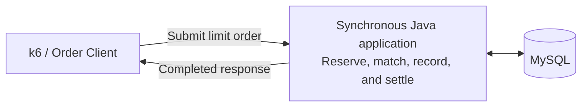
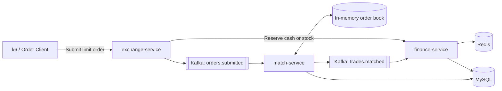

# Assignment 2 Project Proposal Draft: Sections 1-7

> Project direction: [Assignment 2 Project Starting Point](02-project-core-idea.md)

> Table of Contents
>
> - [1. Introduction](#1-introduction)
> - [2. Research Background](#2-research-background)
>   - [2.1. What Existing Research Shows](#21-what-existing-research-shows)
>   - [2.2. What Is Missing](#22-what-is-missing)
>   - [2.3. How This Project Responds](#23-how-this-project-responds)
> - [3. Problem Statement](#3-problem-statement)
> - [4. Research Questions](#4-research-questions)
> - [5. Aim and Objectives](#5-aim-and-objectives)
>   - [5.1. Research Aim](#51-research-aim)
>   - [5.2. Research Objectives](#52-research-objectives)
> - [6. Scope of the Research](#6-scope-of-the-research)
> - [7. Significance of the Research](#7-significance-of-the-research)
> - [8. Research Methodology](#8-research-methodology)
>   - [8.1. Research Design](#81-research-design)
>   - [8.2. Experimental System and Setup](#82-experimental-system-and-setup)
>   - [8.3. Experimental Configurations](#83-experimental-configurations)
>     - [8.3.1. Synchronous Database Baseline](#831-synchronous-database-baseline)
>     - [8.3.2. Kafka-Based Sequential Processing](#832-kafka-based-sequential-processing)
>     - [8.3.3. In-Memory Order Matching](#833-in-memory-order-matching)
>     - [8.3.4. Redis-Based Reservation](#834-redis-based-reservation)
>     - [8.3.5. Microservice Configuration](#835-microservice-configuration)
>     - [8.3.6. Further Performance Iterations](#836-further-performance-iterations)
>   - [8.4. Experimental Procedure](#84-experimental-procedure)
>     - [8.4.1. Step 1: Prepare the Configuration](#841-step-1-prepare-the-configuration)
>     - [8.4.2. Step 2: Execute the Benchmark](#842-step-2-execute-the-benchmark)
>     - [8.4.3. Step 3: Validate and Record the Result](#843-step-3-validate-and-record-the-result)
>   - [8.5. Measurement and Data Analysis](#85-measurement-and-data-analysis)
>   - [8.6. Reliability, Validity, Ethics, and Limitations](#86-reliability-validity-ethics-and-limitations)
> - [9. Research Plan](#9-research-plan)
> - [10. Summary](#10-summary)
> - [11. References](#11-references)

> Draft status: This file contains the first seven proposal sections. The Abstract will be written last after the methodology, research plan, and summary are complete.

## 1. Introduction

Modern software systems often need to handle many requests at the same time. When demand increases, the system may become slow, return errors, or stop processing work reliably. Achieving high concurrency therefore means more than accepting a large number of requests. The system must complete a high volume of transactions consistently and continue doing so under sustained demand.

Many areas of a system can be improved to increase TPS, including the application, database, cache, messaging service, network, and use of computing resources. Each area offers different performance techniques, but their value depends on the system and workload. These techniques are tools for increasing TPS; they are not the final goal. Although this project will evaluate a Java microservice system, the general improvement approach may also be useful for systems developed with other languages and technologies. The experimental findings will remain limited to the selected Java system.

The selected experimental system is Exchange Lab, a backend system modelled on a stock exchange. It supports limit buy and sell orders, in which a trader specifies the stock symbol, quantity, and maximum buying price or minimum selling price. Processing an order may require the system to reserve the trader's cash or stock, match compatible orders by price and submission time, record the resulting trade, and settle the affected balances. The system is used as a transaction-processing testbed; the research does not attempt to reproduce every function of a commercial stock exchange.

This research will measure the system's baseline TPS, identify the current bottleneck, apply an appropriate technique, and test the system again. The process will show how far sustainable completed TPS can be increased within the defined environment. Response time, errors, unfinished work, and resource usage will be monitored to ensure that a higher TPS remains stable and meaningful. The following sections explain the research background, problem, questions, aim, objectives, scope, and significance before presenting the methodology and research plan.

## 2. Research Background

### 2.1. What Existing Research Shows

Previous research shows that high concurrency depends on the complete system, not one programming feature or service. Studies have tested application-level concurrency, caching, asynchronous processing, traffic management, scaling, and overload control. Their results show that these techniques can improve performance, but their value changes with the workload, framework, system structure, and available dependency capacity (Henning & Hasselbring, 2024; Navarro et al., 2023; Xing et al., 2025; Zhang et al., 2024). The practical value of a technique depends on whether it produces a measurable increase in sustainable completed TPS in the system being tested.

These findings also show why a technique cannot be judged by its description alone. Increasing request concurrency helps only while the rest of the system can process the additional work. Caching or asynchronous processing may reduce immediate work, but completed TPS still depends on the full transaction path. The system must therefore be measured as a whole.

### 2.2. What Is Missing

Existing studies use different applications, environments, workloads, test durations, and performance measurements. Many evaluate one component in isolation and report a local improvement without showing the effect on the complete request path. An improvement may therefore move the bottleneck instead of increasing completed end-to-end throughput (Meijer et al., 2024). The available evidence does not clearly show how far sustainable completed TPS can be increased when relevant improvements are selected from system measurements and applied iteratively across the same Java microservice system under consistent conditions.

Developers therefore have many possible techniques but limited guidance on which ones will produce the largest gain in a particular system. A controlled end-to-end test is needed to connect each applied change to a measurable difference in TPS.

### 2.3. How This Project Responds

This project will use one Java microservice system, a consistent workload, and the same measurements across all tests. It will establish the baseline, identify improvement opportunities, apply relevant techniques, and retest the system repeatedly. The purpose is to push sustainable completed TPS as high as possible while latency, errors, stability, unfinished work, and resource usage remain acceptable.

A change will be considered useful only when it increases sustainable TPS for the complete system. This keeps the project focused on the final result rather than the number or complexity of the techniques used.

## 3. Problem Statement

> Many areas of a high-concurrency Java microservice system can be improved to increase throughput. The problem is how to identify and apply the most effective improvements across the system to push sustainable completed TPS as high as possible.

The practical problem is not a shortage of performance techniques. It is determining which techniques genuinely raise the completed transaction rate of the selected system. Without a consistent baseline and repeated testing, an apparent improvement may only shift waiting work elsewhere or produce a short-lived peak that cannot be sustained.

Different parts of the system offer different opportunities for improvement. However, a technique that improves one system or workload may provide little benefit in another, and improving one area may change the behaviour of the remaining system. Each change must therefore be selected and measured according to its effect on completed end-to-end TPS (Henning & Hasselbring, 2024; Meijer et al., 2024).

The study will follow a repeated cycle of measuring the baseline, locating the bottleneck, applying a suitable technique, and measuring again. Its primary outcome will be the highest sustainable completed TPS achieved within the test environment. Latency, errors, unfinished work, and resource usage will act as limits to ensure that the reported improvement remains stable and useful.

## 4. Research Questions

The study will address the following research questions:

1. RQ1: What TPS can the current system sustain before any improvements?
2. RQ2: Which applied techniques increase sustainable TPS, and by how much?
3. RQ3: What is the highest sustainable TPS achieved after applying the relevant improvements?

## 5. Aim and Objectives

### 5.1. Research Aim

To maximise the sustainable TPS of the selected Java microservice system.

### 5.2. Research Objectives

The research objectives are:

1. O1: To measure the system's current sustainable TPS.
2. O2: To identify suitable techniques for increasing TPS.
3. O3: To apply the selected techniques.
4. O4: To determine the highest sustainable TPS achieved.

## 6. Scope of the Research

This research focuses on improving the sustainable TPS of one selected Java microservice system. It will first establish the system's current TPS. Relevant performance techniques will then be applied and tested in the same environment. The study will determine the highest sustainable TPS achieved within the available project time and resources.

The work is limited to components available in the selected system and techniques that can be implemented during the project. The findings will explain what worked under the chosen workload and environment. They will not be treated as a universal configuration for every Java or microservice system.

## 7. Significance of the Research

This research matters because a system that sustains a higher TPS can complete more transactions during heavy demand. Measuring the complete system will show whether an improvement produces a real end-to-end gain rather than only making one component faster (Henning & Hasselbring, 2024; Meijer et al., 2024). The final result will show how far TPS was increased and the conditions under which that increase remained sustainable.

The practical value is a clear record of the changes that worked in the selected system. Developers can adapt the same measurement-based process when improving similar systems. The research also extends the Assignment 1 literature review by testing relevant techniques in a working system and producing experimental evidence.

## 8. Research Methodology

### 8.1. Research Design

This study adopts a quantitative experimental design to investigate how different performance techniques affect the sustainable completed TPS of the selected Java microservice system. The unit of analysis is the end-to-end processing of a limit order, beginning when the order is submitted and ending when the resulting trade settlement is completed. Controlled experiments will compare versioned system configurations under the same workload and test environment.

The initial comparison will begin with the basic synchronous database implementation. Later configurations will introduce Kafka-based processing, in-memory order matching, Redis-based reservation, and the current microservice implementation in controlled stages. After these foundational configurations have been evaluated, the current correct implementation will become the baseline for further optimisation. Measurements and profiling will be used to identify its active bottleneck. One relevant improvement will then be applied before the same test is repeated. This measure, identify, improve, and retest cycle will continue while feasible changes produce valid end-to-end gains.

The independent variable is the system configuration or performance technique applied during each experiment. The primary dependent variable is sustainable completed TPS. Latency, error rate, unfinished work, resource usage, and data correctness will be used as supporting measures. Hardware, seed data, workload, request rate, test duration, warm-up, and drain conditions will be controlled when configurations are compared. A configuration will not be treated as an improvement when it raises apparent throughput by allowing errors, incorrect financial data, or continuously growing backlog. This design supports the measurement of the initial system in RQ1, the comparison of applied techniques in RQ2, and the determination of the highest sustainable TPS in RQ3.

### 8.2. Experimental System and Setup

The experimental testbed is Exchange Lab, a Java and Spring Boot backend for processing stock limit orders. Its business scope is intentionally narrow so that one complete transaction path can be tested repeatedly. A request submits a buy or sell order containing a trader identifier, stock symbol, limit price, and quantity. Processing includes validating the order, reserving cash or stock, matching compatible orders by price-time priority, recording any trade, and settling the affected balances. A transaction is considered complete when settlement finishes successfully.

All configurations will be tested on the same hardware with the same seed data, workload, test duration, and measurement procedure. MySQL 8.4 provides durable data storage, while Kafka 4.1.0 and Redis 7.4 are introduced only in the configurations that require them. Docker Compose will provide repeatable infrastructure. k6 will generate the workload, Micrometer and Spring Boot Actuator will record stage counters, and Kafka lag, JVM and operating-system measurements, and SQL verification queries will provide additional performance and correctness evidence. Exact hardware, software, JVM, and workload settings will be recorded before the formal experiments.

### 8.3. Experimental Configurations

The experiment will compare the following staged configurations. Each stage introduces one major architectural technique while retaining the same limit-order workload and evaluation rules.

#### 8.3.1. Synchronous Database Baseline

The baseline uses one Java application and MySQL. A request performs reservation, database-based matching, trade recording, and settlement synchronously before returning a response.

*Figure 1. Synchronous database baseline.*

#### 8.3.2. Kafka-Based Sequential Processing

Kafka is introduced between order intake and matching. The API accepts and queues the order, while one consumer processes matching sequentially to prevent concurrent requests from modifying the same resting order.

#### 8.3.3. In-Memory Order Matching

The active order book is moved from repeated database queries into an in-memory price-time structure. MySQL remains the durable store for orders and trades.

#### 8.3.4. Redis-Based Reservation

Redis is introduced for atomic cash and stock availability checks before accepted orders are published to Kafka. MySQL continues to hold the durable financial records.

#### 8.3.5. Microservice Configuration

The application is divided into exchange, match, and finance services. The exchange service accepts orders, the match service owns the in-memory order book, and the finance service performs reservation and settlement.

*Figure 2. Current Exchange Lab microservice configuration.*

#### 8.3.6. Further Performance Iterations

After the staged configurations are compared, the current correct configuration will be profiled. Further improvements will be selected from the measured bottleneck and applied one at a time before retesting.

### 8.4. Experimental Procedure

Each experimental configuration will be evaluated using the following three-step procedure.

#### 8.4.1. Step 1: Prepare the Configuration

1. Load the required configuration from its recorded Git commit or a separate experimental worktree.
2. Build the application and start only the infrastructure required by that configuration.
3. Reset MySQL, Kafka, and Redis state where applicable so that no earlier run affects the next result.
4. Load the same trader accounts, stock positions, and initial sell orders from the controlled seed dataset.
5. Start the application, confirm that every required component is healthy, and allow the JVM to warm up.
6. Record the commit, configuration, hardware, JVM settings, and workload parameters used for the run.

#### 8.4.2. Step 2: Execute the Benchmark

1. Start with a target request rate that the configuration is expected to sustain.
2. Run the standard limit-buy-order workload for the fixed measurement period.
3. Increase the target rate in predefined steps and repeat the same workload.
4. Continue until completed TPS stops following the target rate or a sustainability condition fails.
5. Repeat the tests around the observed boundary to identify the highest sustainable rate.
6. For the current configuration, collect profiling evidence at the first bottleneck before selecting a further improvement.

#### 8.4.3. Step 3: Validate and Record the Result

1. Stop generating new requests and allow asynchronous orders and trades to drain for the fixed drain period.
2. Record completed TPS, stage TPS, latency, error rate, Kafka lag, unfinished work, and resource usage.
3. Run the SQL verification checks for total cash, stock quantity, reservations, order states, and trade records.
4. Mark the run as invalid if data is incorrect, errors exceed the defined limit, or backlog continues to grow.
5. Repeat each important boundary test three times under the same conditions.
6. Store the run configuration and measurements before testing the next system configuration.

### 8.5. Measurement and Data Analysis

### 8.6. Reliability, Validity, Ethics, and Limitations

## 9. Research Plan

The project is planned over six months, as shown in the Gantt chart below.

*Figure 3. Provisional research plan. The schedule will be updated when the official project start and submission dates are confirmed.*

## 10. Summary

## 11. References

Avritzer, A., Janes, A., Rodrigues, H., Cai, Y., Schoyen, T., Pisch, E., Trubiani, C., Bondi, A. B., Menasché, D. S., & Zhang, C. (2026). Automated assessment of the relationship between microservice architectures and performance. *Journal of Systems and Software, 237*, Article 112857. https://doi.org/10.1016/j.jss.2026.112857

Henning, S., & Hasselbring, W. (2024). Benchmarking scalability of stream processing frameworks deployed as microservices in the cloud. *Journal of Systems and Software, 208*, Article 111879. https://doi.org/10.1016/j.jss.2023.111879

Meijer, W., Trubiani, C., & Aleti, A. (2024). Experimental evaluation of architectural software performance design patterns in microservices. *Journal of Systems and Software, 218*, Article 112183. https://doi.org/10.1016/j.jss.2024.112183

Navarro, A., Ponge, J., Le Mouël, F., & Escoffier, C. (2023). Considerations for integrating virtual threads in a Java framework: A Quarkus example in a resource-constrained environment. In *Proceedings of the 17th ACM international conference on distributed and event-based systems* (pp. 103-114). ACM. https://doi.org/10.1145/3583678.3596895

Xing, J., Giannoukos, A., Loh, P., Wang, S., Qiu, J., Demoulin, H. M., Kallas, K., & Lee, B. C. (2025). Rajomon: Decentralized and coordinated overload control for latency-sensitive microservices. In *22nd USENIX symposium on networked systems design and implementation (NSDI 25)* (pp. 21-36). USENIX Association. https://www.usenix.org/conference/nsdi25/presentation/xing

Zhang, H., Kallas, K., Pavlatos, S., Alur, R., Angel, S., & Liu, V. (2024). MuCache: A general framework for caching in microservice graphs. In *21st USENIX symposium on networked systems design and implementation (NSDI 24)* (pp. 221-238). USENIX Association. https://www.usenix.org/conference/nsdi24/presentation/zhang-haoran
