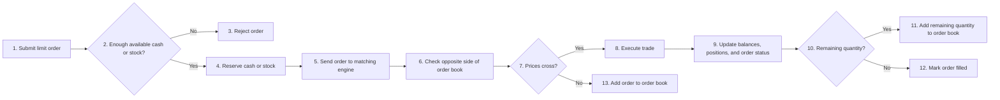

# Event Storming

> **Table of Contents**
>
> - [1. Overview](#1-overview)
> - [2. Limit Order Flow](#2-limit-order-flow)
> - [3. Event Storming Board](#3-event-storming-board)
> - [4. Commands](#4-commands)
> - [5. Events](#5-events)

## 1. Overview

This document captures the main commands, events, and flow for Phase 1 before designing tables, APIs, or code.

## 2. Limit Order Flow

Phase 1 starts with automated traders submitting buy and sell limit orders into the market engine.

1. Submit limit order: an automated trader submits a buy or sell limit order.
2. Check available cash or stock: the system checks whether the trader can afford the order.
3. Reject order: invalid orders stop here.
4. Reserve cash or stock: buy orders reserve cash, and sell orders reserve stock.
5. Send order to matching engine: accepted orders enter the market engine.
6. Check opposite side of order book: buy orders check sells, and sell orders check buys.
7. Prices cross: matching can happen when the buy price is greater than or equal to the sell price.
8. Execute trade: the system creates one or more trades.
9. Update balances, positions, and order status: settlement is applied after each trade.
10. Remaining quantity: the system checks whether the incoming order still has unfilled quantity.
11. Add remaining quantity to order book: partially filled orders can remain open.
12. Mark order filled: fully filled orders are completed.
13. Add order to order book: unmatched accepted orders remain open.

## 3. Event Storming Board

This board shows the same behavior in a sticky-note style using commands, rules, and events.

```mermaid
flowchart LR
    C1["1. Command: Place buy or sell limit order"] --> E1["2. Event: Limit order submitted"]
    E1 --> R1["3. Rule: Check available cash or stock"]
    R1 -- Invalid --> E2["4. Event: Order rejected"]
    R1 -- Valid --> E3["5. Event: Cash or stock reserved"]
    E3 --> E4["6. Event: Order accepted"]
    E4 --> R2["7. Rule: Match against opposite side of order book"]
    R2 -- Match found --> E5["8. Event: Order matched"]
    R2 -- No match --> E11["17. Event: Order added to book"]
    E5 --> E6["9. Event: Trade executed"]
    E6 --> R3["10. Rule: Settle trade"]
    R3 --> E7["11. Event: Cash balance updated"]
    R3 --> E8["12. Event: Stock position updated"]
    E6 --> E9["13. Event: Market price updated"]
    E7 --> R4["14. Rule: Update order fill state"]
    E8 --> R4
    E9 --> R4
    R4 -- Remaining quantity --> E10["15. Event: Order partially filled"]
    R4 -- Fully filled --> E12["16. Event: Order filled"]
    E10 --> E11
```

## 4. Commands

- Place buy limit order
- Place sell limit order

## 5. Events

- Limit order submitted
- Order rejected
- Cash reserved
- Stock reserved
- Order accepted
- Order matched
- Trade executed
- Order partially filled
- Order filled
- Order added to book
- Cash balance updated
- Stock position updated
- Market price updated
