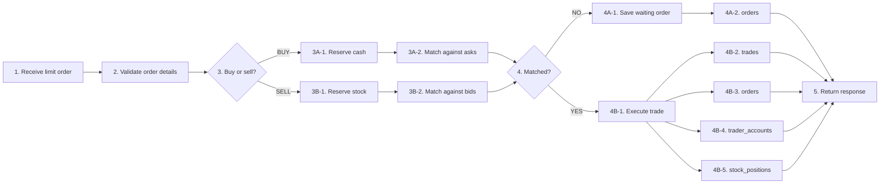

# Order Flow

> **Table of Contents**
>
> - [1. Overview](#1-overview)
> - [2. Current Flow](#2-current-flow)

## 1. Overview

One API accepts both buy and sell limit orders. The current flow is synchronous:
the system receives the order, checks whether the trader has enough cash or
stock, tries to match the order with existing orders, saves the waiting order or
executed trade result, and returns a response.

## 2. Current Flow

1. The system receives the order.
   - Buy example: Trader A submits a buy limit order for `10` units of `ACME`
     at `100`.
   - Sell example: Trader B submits a sell limit order for `10` units of `ACME`
     at `95`.
2. The system checks that the order has a trader, symbol, side, price, and
   quantity.
3. The system checks whether this is a buy order or sell order.
   - Buy path:
     - **3A-1.** For Trader A, the system checks and reserves enough cash:
       `10 * 100 = 1000`.
     - **3A-2.** Trader A's buy order is matched against existing asks.
   - Sell path:
     - **3B-1.** For Trader B, the system checks and reserves `10` units of
       `ACME`.
     - **3B-2.** Trader B's sell order is matched against existing bids.
4. The system checks whether the order matched.
   - No-match path:
     - **4A-1.** If Trader A has no matching ask, or Trader B has no matching
       bid, the order is saved as a waiting order.
     - **4A-2.** The waiting order is stored in `orders` with `ACCEPTED`
       status.
   - Matched path:
     - **4B-1.** If Trader A's buy order matches an ask, or Trader B's sell
       order matches a bid, the system executes a trade.
     - **4B-2.** The trade is saved in `trades`.
     - **4B-3.** The order status is saved in `orders` as `FILLED` or
       `PARTIALLY_FILLED`.
     - **4B-4.** The buyer and seller cash are updated in `trader_accounts`.
     - **4B-5.** The buyer and seller stock are updated in `stock_positions`.
5. The system returns a response.
