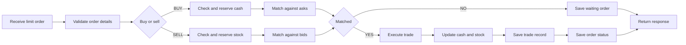

# Order Flow

> **Table of Contents**
>
> - [1. Overview](#1-overview)
> - [2. Current Flow](#2-current-flow)

## 1. Overview

One API accepts both buy and sell limit orders. The current flow is synchronous:
the system receives the order, checks whether the trader has enough cash or
stock, tries to match the order with existing orders, saves the waiting order or
executed trade result, and returns a response.

## 2. Current Flow

1. The system receives a buy or sell limit order.
2. The system checks the order details.
3. For a buy order, the system checks and reserves enough cash.
4. For a sell order, the system checks and reserves enough stock.
5. A buy order is compared with ask orders in the order book.
6. A sell order is compared with bid orders in the order book.
7. If no match exists, the order is saved in the `orders` table with `ACCEPTED`
   status.
8. If a match exists, the system executes the trade.
9. The system updates buyer/seller cash and stock.
10. The system saves the trade record in the `trades` table.
11. The system saves the changed order status in the `orders` table: `FILLED`
    or `PARTIALLY_FILLED`.
12. The system returns a response.
