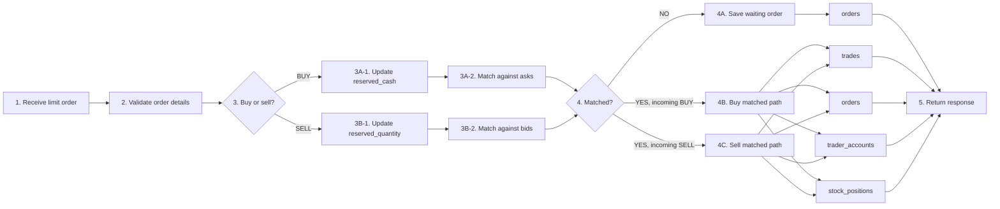

# Order Flow

> **Table of Contents**
>
> - [1. Overview](#1-overview)
> - [2. Current Flow](#2-current-flow)

## 1. Overview

One API accepts both buy and sell limit orders. The current flow is synchronous:
the system receives the order, checks whether the trader has enough cash or
stock, tries to match the order with existing orders, saves the waiting order or
executed trade result, and returns a response.

## 2. Current Flow

1. The system receives the order.
   - Buy example: Trader A submits a buy limit order for `10` units of `ACME`
     at `100`.
   - Sell example: Trader B submits a sell limit order for `10` units of `ACME`
     at `95`.
2. The system checks that the order has a trader, symbol, side, price, and
   quantity.
3. The system checks whether this is a buy order or sell order.
   - Buy path:
     - **3A-1.** For Trader A, the system reserves enough cash.
       - `trader_accounts.reserved_cash += 1000` (`10 units * 100 price`)
     - **3A-2.** Trader A's buy order is matched against existing asks.
       - Match rule: `ask.limit_price <= buy.limit_price`
       - Best ask first: lowest ask price, then oldest order.
   - Sell path:
     - **3B-1.** For Trader B, the system reserves enough stock.
       - `stock_positions.reserved_quantity += 10 units`
     - **3B-2.** Trader B's sell order is matched against existing bids.
       - Match rule: `bid.limit_price >= sell.limit_price`
       - Best bid first: highest bid price, then oldest order.
4. The system checks whether the order matched.
   - No-match path:
     - **4A.** If Trader A has no matching ask, or Trader B has no matching
       bid, insert a new waiting order row into `orders`.
       - `orders.status = ACCEPTED`
       - `orders.remaining_quantity = orders.quantity`
   - Buy matched path:
     - **4B.** Trader A's buy order matches an existing ask.
       - Trade quantity:
         `min(buy.remaining_quantity, ask.remaining_quantity)`
       - `trades`: insert trade row.
       - `orders`: update remaining quantity and status.
         - Full match: `remaining_quantity = 0`, `status = FILLED`
         - Partial match: `remaining_quantity > 0`, `status = PARTIALLY_FILLED`
       - `trader_accounts`: buyer pays cash, seller receives cash.
       - `stock_positions`: buyer receives stock, seller delivers stock.
   - Sell matched path:
     - **4C.** Trader B's sell order matches an existing bid.
       - Trade quantity:
         `min(sell.remaining_quantity, bid.remaining_quantity)`
       - `trades`: insert trade row.
       - `orders`: update remaining quantity and status.
         - Full match: `remaining_quantity = 0`, `status = FILLED`
         - Partial match: `remaining_quantity > 0`, `status = PARTIALLY_FILLED`
       - `trader_accounts`: buyer pays cash, seller receives cash.
       - `stock_positions`: seller delivers stock, buyer receives stock.
5. The system returns a response.
