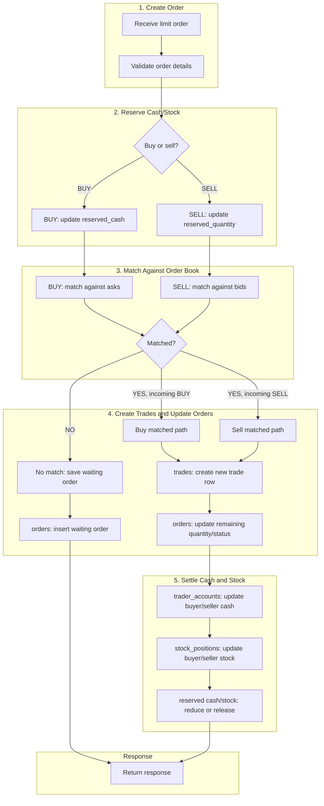

# Order Flow

> **Table of Contents**
>
> - [1. Overview](#1-overview)
> - [2. Step Details](#2-step-details)
> - [3. Pseudocode Flow](#3-pseudocode-flow)

## 1. Overview

The current `POST /api/orders/limit` API is synchronous and categorized into five stages:

1. Create order.
2. Reserve cash/stock.
3. Match against order book.
4. Create trades and update orders.
5. Settle cash and stock.



## 2. Step Details

1. Create order.
   - Buy example: Trader A submits a buy limit order for `10` units of `ACME`
     at `100`.
   - Sell example: Trader B submits a sell limit order for `10` units of `ACME`
     at `95`.
   - The order must have a trader, symbol, side, price, and quantity.
2. Reserve cash/stock.
   - Buy path: reserve enough cash.
     - `trader_accounts.reserved_cash += 1000` (`10 units * 100 price`)
   - Sell path: reserve enough stock.
     - `stock_positions.reserved_quantity += 10 units`
3. Match against order book.
   - Buy path: match against existing asks.
     - Match rule: `ask.limit_price <= buy.limit_price`
     - Best ask first: lowest ask price, then oldest order.
   - Sell path: match against existing bids.
     - Match rule: `bid.limit_price >= sell.limit_price`
     - Best bid first: highest bid price, then oldest order.
4. Create trades and update orders.
   - No match: insert a waiting order row into `orders`.
     - `orders.status = ACCEPTED`
     - `orders.remaining_quantity = orders.quantity`
   - Matched result:
     - `trades`: create new trade row.
     - `orders`: update remaining quantity/status.
5. Settle cash and stock.
   - Matched result:
     - `trader_accounts`: update buyer/seller cash.
     - `stock_positions`: update buyer/seller stock.
     - Reserved cash or stock is reduced/released during settlement.

## 3. Pseudocode Flow

```text
# 1. Create order
receive order
validate order

# 2. Reserve cash/stock
if BUY:
    reserve cash
else SELL:
    reserve stock

# 3. Match against order book
matchingOrders = find matching opposite orders
executedTrades = []
updatedMatchingOrders = []

for each matchingOrder:
    if incomingOrder has no remaining quantity:
        stop matching

    tradeQuantity = min(incomingOrder.remainingQuantity, matchingOrder.remainingQuantity)

    create trade
    update incoming order remaining quantity/status
    update matching order remaining quantity/status

    add trade to executedTrades
    add matchingOrder to updatedMatchingOrders

# 4. Create trades and update orders
save incoming order
save updated matching orders
save executed trades

# 5. Settle cash and stock
for each trade:
    update buyer cash
    update seller cash
    update buyer stock
    update seller stock
    reduce/release reserved cash or stock

save updated trader accounts
save updated stock positions
```
