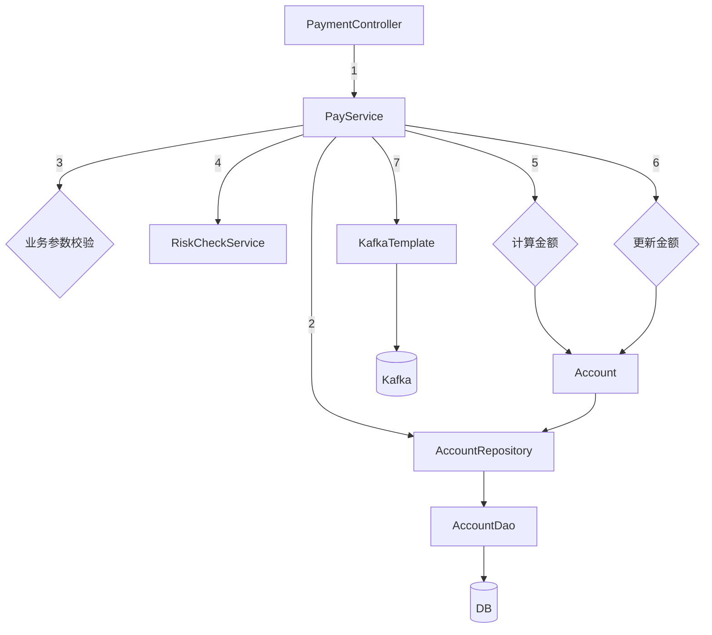

# DDD Study: Service-Heavy Baseline

> **Table of Contents**
>
> - [1. Controller-Service-Repository Usual Architecture](#1-controller-service-repository-usual-architecture)
> - [2. DDD Transformation](#2-ddd-transformation)
>   - [2.1 Step One: Abstract The Data Storage Layer](#21-step-one-abstract-the-data-storage-layer)

## 1. Controller-Service-Repository Usual Architecture

In this version, the controller is thin, but almost everything is clumped inside
the service layer.



```java
public class PaymentController {

    private PayService payService;

    public Result pay(String merchantAccount, BigDecimal amount) {
        Long userId = (Long) session.getAttribute("userId");
        return payService.pay(userId, merchantAccount, amount);
    }
}

public class PayServiceImpl implements PayService {

    private AccountDao accountDao; // 操作数据库
    private KafkaTemplate<String, String> kafkaTemplate; // 操作kafka
    private RiskCheckService riskCheckService; // 风控微服务接口

    public Result pay(Long userId, String merchantAccount, BigDecimal amount) {
        // 1. 从数据库读取数据
        AccountDO clientDO = accountDao.selectByUserId(userId);
        AccountDO merchantDO = accountDao.selectByAccountNumber(merchantAccount);

        // 2. 业务参数校验
        if (amount.compareTo(clientDO.getAvailable()) > 0) {
            throw new NoMoneyException();
        }

        // 3. 调用风控微服务
        RiskCode riskCode = riskCheckService.checkPayment(...);

        // 4. 检查交易合法性
        if (!"0000".equals(riskCode)) {
            throw new InvalidOperException();
        }

        // 5. 计算新值，并且更新字段
        BigDecimal newSource = clientDO.getAvailable().subtract(amount);
        BigDecimal newTarget = merchantDO.getAvailable().add(amount);

        clientDO.setAvailable(newSource);
        merchantDO.setAvailable(newTarget);

        // 6. 更新到数据库
        accountDao.update(clientDO);
        accountDao.update(merchantDO);

        // 7. 发送审计消息
        String message = userId + "," + merchantAccount + "," + amount;
        kafkaTemplate.send(TOPIC_AUDIT_LOG, message);

        return Result.SUCCESS;
    }
}
```

## 2. DDD Transformation

### 2.1 Step One: Abstract The Data Storage Layer (抽象数据存储层)

1. Use a rich model (充血模型) entity object (实体对象) to describe core business
   ability.

   ```java
   public class Account {

       private Long id;
       private Long accountNumber;
       private BigDecimal available;

       public void withdraw(BigDecimal money) {
           // transfer-in operation (转入操作)
           available = available.add(money);
       }

       public void deposit(BigDecimal money) {
           // transfer-out operation (转出操作)
           if (available.compareTo(money) < 0) {
               throw new InsufficientMoneyException();
           }

           available = available.subtract(money);
       }
   }
   ```

2. Use a repository (仓库) and factory/builder (工厂) to wrap entity persistence
   operations (实体持久化操作).

   ```java
   public interface AccountRepository {

       Account find(Long id);

       Account findByAccountNumber(Long accountNumber);

       Account save(Account account);
   }

   public class AccountRepositoryImpl implements AccountRepository {

       @Autowired
       private AccountDao accountDAO;

       @Autowired
       private AccountBuilder accountBuilder;

       @Override
       public Account find(Long id) {
           AccountDO accountDO = accountDAO.selectById(id);
           return accountBuilder.toAccount(accountDO);
       }

       @Override
       public Account findByAccountNumber(Long accountNumber) {
           AccountDO accountDO = accountDAO.selectByAccountNumber(accountNumber);
           return accountBuilder.toAccount(accountDO);
       }

       @Override
       public Account save(Account account) {
           AccountDO accountDO = accountBuilder.fromAccount(account);

           if (accountDO.getId() == null) {
               accountDAO.insert(accountDO);
           } else {
               accountDAO.update(accountDO);
           }

           return accountBuilder.toAccount(accountDO);
       }
   }
   ```
