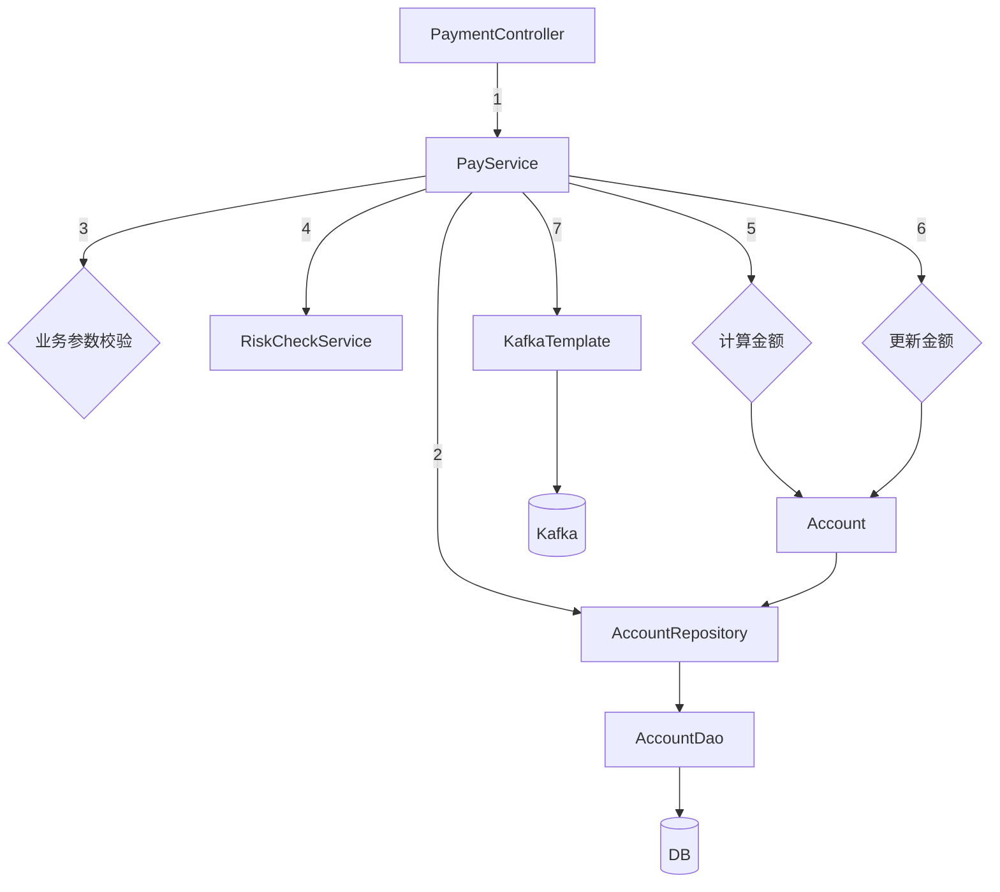

# DDD Study: Service-Heavy Baseline

> **Table of Contents**
>
> - [1. Controller-Service-Repository Usual Architecture](#section-1-controller-service-repository-usual-architecture)
> - [2. DDD Transformation](#section-2-ddd-transformation)
>   - [2.1 Step One: Abstract The Data Storage Layer (抽象数据存储层)](#section-2-1-step-one-abstract-the-data-storage-layer)
>   - [2.2 Step Two: Abstract Third-Party Services With Anti-Corruption Layer (抽象第三方服务，防腐层)](#section-2-2-step-two-abstract-third-party-services-with-anti-corruption-layer)
>   - [2.3 Step Three: Abstract Middleware With Anti-Corruption Layer (抽象中间件，防腐层)](#section-2-3-step-three-abstract-middleware-with-anti-corruption-layer)
>   - [2.4 Step Four: Use Domain Service To Wrap Multi-Entity Logic (领域服务，跨实体业务)](#section-2-4-step-four-use-domain-service-to-wrap-multi-entity-logic)
> - [3. Outcome After Step One To Step Four](#3-outcome-after-step-one-to-step-four)

<a id="section-1-controller-service-repository-usual-architecture"></a>
## 1. Controller-Service-Repository Usual Architecture

In this version, the controller is thin, but almost everything is clumped inside
the service layer.



```java
public class PaymentController {

    private PayService payService;

    public Result pay(String merchantAccount, BigDecimal amount) {
        Long userId = (Long) session.getAttribute("userId");
        return payService.pay(userId, merchantAccount, amount);
    }
}

public class PayServiceImpl implements PayService {

    private AccountDao accountDao; // 操作数据库
    private KafkaTemplate<String, String> kafkaTemplate; // 操作kafka
    private RiskCheckService riskCheckService; // 风控微服务接口

    public Result pay(Long userId, String merchantAccount, BigDecimal amount) {
        // 1. 从数据库读取数据
        AccountDO clientDO = accountDao.selectByUserId(userId);
        AccountDO merchantDO = accountDao.selectByAccountNumber(merchantAccount);

        // 2. 业务参数校验
        if (amount.compareTo(clientDO.getAvailable()) > 0) {
            throw new NoMoneyException();
        }

        // 3. 调用风控微服务
        RiskCode riskCode = riskCheckService.checkPayment(...);

        // 4. 检查交易合法性
        if (!"0000".equals(riskCode)) {
            throw new InvalidOperException();
        }

        // 5. 计算新值，并且更新字段
        BigDecimal newSource = clientDO.getAvailable().subtract(amount);
        BigDecimal newTarget = merchantDO.getAvailable().add(amount);

        clientDO.setAvailable(newSource);
        merchantDO.setAvailable(newTarget);

        // 6. 更新到数据库
        accountDao.update(clientDO);
        accountDao.update(merchantDO);

        // 7. 发送审计消息
        String message = userId + "," + merchantAccount + "," + amount;
        kafkaTemplate.send(TOPIC_AUDIT_LOG, message);

        return Result.SUCCESS;
    }
}
```

<a id="section-2-ddd-transformation"></a>
## 2. DDD Transformation

<a id="section-2-1-step-one-abstract-the-data-storage-layer"></a>
### 2.1 Step One: Abstract The Data Storage Layer (抽象数据存储层)

1. Use a rich model (充血模型) entity object (实体对象) to describe core business
   ability.

   ```java
   public class Account {

       private Long id;
       private Long accountNumber;
       private BigDecimal available;

       public void withdraw(BigDecimal money) {
           // transfer-in operation (转入操作)
           available = available.add(money);
       }

       public void deposit(BigDecimal money) {
           // transfer-out operation (转出操作)
           if (available.compareTo(money) < 0) {
               throw new InsufficientMoneyException();
           }

           available = available.subtract(money);
       }
   }
   ```

2. Use a repository (仓库) and factory/builder (工厂) to wrap entity persistence
   operations (实体持久化操作).

   ```java
   public interface AccountRepository {

       Account find(Long id);

       Account findByAccountNumber(Long accountNumber);

       Account save(Account account);
   }

   public class AccountRepositoryImpl implements AccountRepository {

       @Autowired
       private AccountDao accountDAO;

       @Autowired
       private AccountBuilder accountBuilder;

       @Override
       public Account find(Long id) {
           AccountDO accountDO = accountDAO.selectById(id);
           return accountBuilder.toAccount(accountDO);
       }

       @Override
       public Account findByAccountNumber(Long accountNumber) {
           AccountDO accountDO = accountDAO.selectByAccountNumber(accountNumber);
           return accountBuilder.toAccount(accountDO);
       }

       @Override
       public Account save(Account account) {
           AccountDO accountDO = accountBuilder.fromAccount(account);

           if (accountDO.getId() == null) {
               accountDAO.insert(accountDO);
           } else {
               accountDAO.update(accountDO);
           }

           return accountBuilder.toAccount(accountDO);
       }
   }
   ```

<a id="section-2-2-step-two-abstract-third-party-services-with-anti-corruption-layer"></a>
### 2.2 Step Two: Abstract Third-Party Services With Anti-Corruption Layer (抽象第三方服务，防腐层)

1. Build an anti-corruption layer (防腐层) to isolate external services
   (外部服务).

   ```java
   public interface BusiSafeService {

       Result checkBusi(Long userId, Long merchantAccount, BigDecimal money);
   }

   public class BusiSafeServiceImpl implements BusiSafeService {

       @Autowired
       private RiskChkService riskChkService;

       public Result checkBusi(Long userId, Long merchantAccount, BigDecimal money) {
           // parameter packaging (参数封装)
           RiskCode riskCode = riskChkService.checkPayment(...);

           if ("0000".equals(riskCode.getCode())) {
               return Result.SUCCESS;
           }

           return Result.REJECT;
       }
   }
   ```

<a id="section-2-3-step-three-abstract-middleware-with-anti-corruption-layer"></a>
### 2.3 Step Three: Abstract Middleware With Anti-Corruption Layer (抽象中间件，防腐层)

1. Use an anti-corruption layer (防腐层) to isolate third-party components
   (第三方组件), remove technical framework limits (技术框架限制), and provide more
   possibilities.

   ```java
   public class AuditMessage {

       private Long userId;
       private Long clientAccount;
       private Long merchantAccount;
       private BigDecimal money;
       private Date data;

       ......
   }

   public interface AuditMessageProducer {

       ......
   }

   public class AuditMessageProducerImpl implements AuditMessageProducer {

       private KafkaTemplate<String, String> kafkaTemplate;

       public SendResult send(AuditMessage message) {
           String messageBody = message.getBody();
           kafkaTemplate.send("some topic", messageBody);

           return SendResult.SUCCESS;
       }
   }
   ```

<a id="section-2-4-step-four-use-domain-service-to-wrap-multi-entity-logic"></a>
### 2.4 Step Four: Use Domain Service To Wrap Multi-Entity Logic (领域服务，跨实体业务)

1. Use a domain service (领域服务) to wrap cross-entity business logic
   (跨实体业务), keeping entities pure (实体纯粹性).

   ```java
   public interface AccountTransferService {

       void transfer(Account sourceAccount, Account targetAccount, Money money);
   }

   public class AccountTransferServiceImpl implements AccountTransferService {

       public void transfer(Account sourceAccount, Account targetAccount, Money money) {
           sourceAccount.deposit(money);
           targetAccount.withdraw(money);
       }
   }
   ```

<a id="section-3-outcome-after-step-one-to-step-four"></a>
## 3. Outcome After Step One To Step Four

After step one to step four, the service no longer directly depends on DAO,
KafkaTemplate, risk check service, or multi-entity transfer logic.

```java
public class PayServiceImpl extends PayService {

    private AccountRepository accountRepository;
    private AuditMessageProducer auditMessageProducer;
    private BusiSafeService busiSafeService;
    private AccountTransferService accountTransferService;

    public Result pay(Account client, Account merchant, Money amount) {
        // load data (加载数据)
        Account clientAccount = accountRepository.find(client.getId());
        Account merAccount = accountRepository.find(merchant.getId());

        // transaction check (交易检查)
        Result preCheck = busiSafeService.checkBusi(client, merchant, money);

        if (preCheck != Result.SUCCESS) {
            return Result.REJECT;
        }

        // transfer business (转账业务)
        accountTransferService.transfer(clientAccount, merAccount, money);

        // save data (保存数据)
        accountRepository.save(clientAccount);
        accountRepository.save(merAccount);

        // send audit message (发送审计消息)
        AuditMessage message = new AuditMessage(clientAccount, merAccount, money);
        auditMessageProducer.send(message);

        return Result.SUCCESS;
    }
}
```
